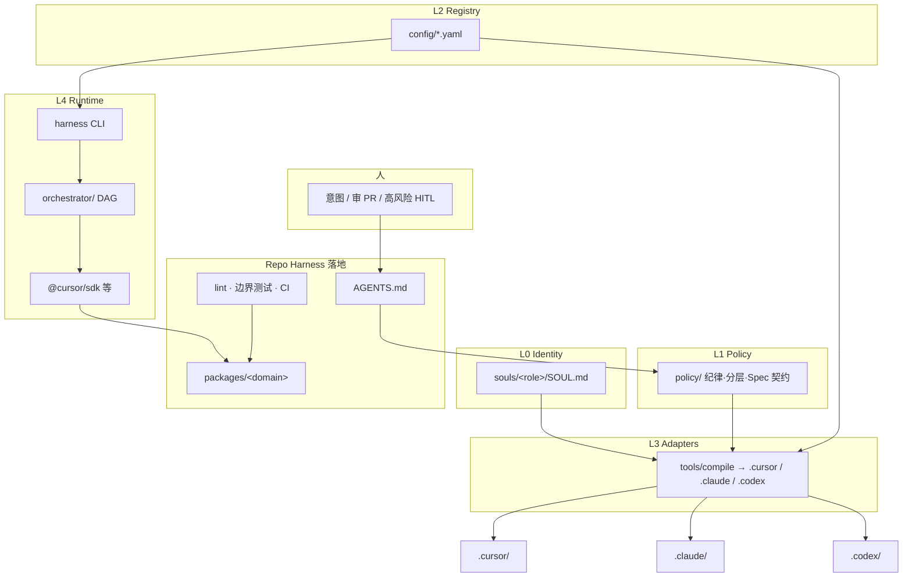
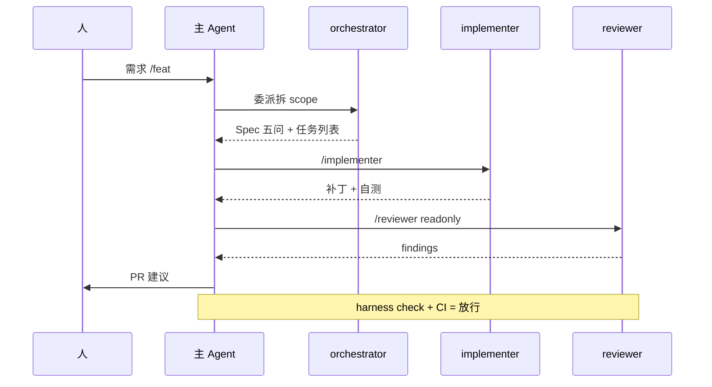

# Harness 工程模板 — 第二版完整方案

> **文档版本**：v2.0  
> **仓库**：`/Users/arron/WorkSpace/Personal/Harness`  
> **定位**：大型技术类项目的 **Agent-First** 工程模板——当前以 **Cursor** 为主 IDE/运行时，后续可接入 **Anthropic**、**Codex** 及各类 **CLI**；统一 **Harness（仓库治理 + 运行时编排）**、**多 Subagent**、**多模型路由**、**每角色 Soul**。  
> **现状**：仅有 `.claude/agents/sdd/` Spec 流水线；无应用代码、无 `.cursor/`、无 Harness 文档体系。  
> **本文性质**：设计与实施蓝图；实施时以 [OpenAI Harness Engineering](https://openai.com/index/harness-engineering/)、[Cursor 文档](https://cursor.com/docs/subagents)、各 Provider 官方 API 为准。

---

## 目录

1. [愿景与边界](#1-愿景与边界)
2. [核心概念：两套 Harness](#2-核心概念两套-harness)
3. [五层架构](#3-五层架构)
4. [成熟度路线](#4-成熟度路线)
5. [目录结构](#5-目录结构)
6. [核心配置](#6-核心配置)
7. [Soul 与角色体系](#7-soul-与角色体系) → 详见 [roles/](./roles/README.md)
8. [多 Provider 与模型路由](#8-多-provider-与模型路由)
9. [工具适配矩阵](#9-工具适配矩阵)
10. [上下文分层（大型工程）](#10-上下文分层大型工程)
11. [工作流](#11-工作流)
12. [Repo Harness：机械约束](#12-repo-harness机械约束)
13. [Runtime Harness：编排与 CLI](#13-runtime-harness编排与-cli)
14. [Eval 与可观测](#14-eval-与可观测)
15. [AGENTS.md 纲要](#15-agentsmd-纲要)
16. [命令与脚本](#16-命令与脚本)
17. [参考映射](#17-参考映射)
18. [风险与缓解](#18-风险与缓解)
19. [验收标准](#19-验收标准)
20. [实施顺序](#20-实施顺序)

---

## 1. 愿景与边界

### 1.1 要解决的问题

| 问题 | 方案层 |
|------|--------|
| 试点能写代码，规模化失控 | **Rule + 机械护栏**（lint、边界测试、CI） |
| 需求模糊导致扩 scope | **Spec**（五问 + SDD / exec-plans） |
| 一次生成、难收敛 | **Loop**（小步、外置状态、done-when） |
| PR / 放行不可信 | **Harness**（评审、GC、证据） |
| 多角色人格漂移 | **每角色 `souls/<role>/SOUL.md`** + 多工具 compile |
| Demo 级多 Agent | **Runtime Orchestrator**（声明式 DAG、预算、失败策略） |
| 工具 / MCP 裸奔 | **Tool Registry**（白名单、Trace、readonly 角色） |
| Cursor 锁定、后续加 Claude/Codex | **Adapter 编译** → `.cursor` / `.claude` / `.codex` |
| 大型 monorepo 上下文爆炸 | **域（Domain）+ 上下文 T1/T2/T3** |

### 1.2 非目标（第一期不做）

- 自研 LangGraph / AutoGen 全栈多 Agent 平台  
- 多租户、分布式任务队列、独立向量记忆服务  
- 替代 Cursor / Claude / Codex 官方 IDE  
- 飞书、微信等非标准集成（除非单独立项）

### 1.3 设计原则

1. **工具无关的事实源**：`souls/`、`policy/`、`config/`；工具目录多为 **编译产物**。  
2. **接收端优先**：瓶颈在验证与放行，不在生成（[Phodal](https://www.phodal.com/blog/from-rule-spec-to-harness-ai-coding-adoption-path/)）。  
3. **控制面逐层外扩**：Rule → Spec → Loop → Harness，有严格依赖。  
4. **Agent 出主意，Harness 拿决定**（编排、工具、预算、终止条件，[李伟山](https://cloud.tencent.com/developer/article/2668186)）。  
5. **Cursor 为主，不为主绑架**：默认 `providers.yaml` 中 `default: cursor`。

---

## 2. 核心概念：两套 Harness

| 名称 | 含义 | 在本模板中的位置 |
|------|------|------------------|
| **Repo Harness** | 文档、分层、Spec、CI、Hooks、GC | `AGENTS.md`、`policy/`、`docs/`、`packages/*`、CI |
| **Runtime Harness** | 编排、Tool Registry、记忆/预算、Eval、Trace | `orchestrator/`、`tools/harness-cli`、`config/tools.registry.yaml` |

**关系**：Repo Harness 约束「写什么、如何合进仓库」；Runtime Harness 约束「谁执行、执行多久、用什么工具与模型」。

**勿混淆**：OpenAI 的 [Harness Engineering](https://openai.com/index/harness-engineering/) 主要指 **Repo Harness**；李伟山文中的 Multi-Agent Harness 偏 **Runtime**——本模板两者并存、目录分离。

---

## 3. 五层架构



| 层 | 职责 | 工具无关 |
|----|------|----------|
| **L0 Identity** | 每角色人格、语气、硬约束 | ✅ |
| **L1 Policy** | NEVER/DO、分层、Spec 契约、评审门禁 | ✅ |
| **L2 Registry** | 角色、域、模型、工具、Provider 开关 | ✅ |
| **L3 Adapters** | 生成各 IDE/CLI 可消费文件 | 按 target |
| **L4 Runtime** | check、compile、dag、doctor | Provider 插件 |

---

## 4. 成熟度路线

### 4.1 Phodal 四层（Repo 侧，必须按序）

```
Rule → Spec → Loop → Harness（Repo）
         ↘
          Loop + Orchestrator（Runtime，依赖 Rule，可与 Spec 并行）
```

| 层 | 回答的问题 | 模板落点 |
|----|------------|----------|
| **Rule** | 别乱来 | `AGENTS.md`、`policy/`、`.cursor/rules/`（编译）、分层 lint/测试 |
| **Spec** | 这次只做什么 | `policy/spec-contract.md`、`docs/exec-plans/`、SDD 流 |
| **Loop** | 如何收敛 | `docs/guides/loop.md`、`artifacts/progress/`、DAG done-when |
| **Harness** | 为何可信 | CI、GC、`docs/fitness/`（可选）、reviewer subagent |

**依赖关系**（摘自 [Phodal](https://www.phodal.com/blog/from-rule-spec-to-harness-ai-coding-adoption-path/)）：

- 无 Rule → Spec 只是给无边界的 Agent 提需求  
- 无 Spec → Loop 放大错误  
- 无 Loop → Harness 只能在 PR/CI 末端捡漏  

### 4.2 实施三阶段

| 阶段 | 周期（建议） | 交付物 | 成功标准 |
|------|--------------|--------|----------|
| **P1 MVP** | 1–2 周 | `policy/` + `souls/` + registry + **Cursor compile** + `demo-domain` + `harness check` | 新人读 `AGENTS.md` 可改 demo；边界测试通过 |
| **P2 Hardening** | 2–3 周 | CI、hooks、**claude/codex compile**、`domains.yaml`、SDD 单源同步、最小 DAG | PR 必过 CI；compile 无漂移 |
| **P3 Scale** | 按需 | 多 Provider DAG driver、eval 轨迹、Tool Registry 强化、成本看板 | 一条业务流可 DAG；可回答「为何可信」 |

**P1 不要**同时接三个 Provider；先打通 **compile 管道**，再逐个 `enabled: true`。

---

## 5. 目录结构

```text
Harness/
├── HARNESS_ENGINEERING/
│   ├── ENGINEER_DOC.md                # 本文档
│   └── roles/                         # README · swimlanes · principles · agents.registry.yaml
├── README.md
├── AGENTS.md                          # ~100 行，唯一 Agent 地图（T1）
├── ARCHITECTURE.md                    # 术语表 + 指向 policy/layers
├── CLAUDE.md                          # P2：指向 AGENTS.md（软链或 include 说明）
├── LICENSE
├── .gitignore
│
├── policy/                            # L1 纪律源（工具无关）
│   README.md
│   layers.yaml                        # 机器可读分层 → lint + 边界测试
│   never-do.md                        # 全局 NEVER（短）
│   spec-contract.md                   # Spec 五问 + 完成定义
│   review.md                          # 评审 / 放行门禁
│   context-tiers.md                   # T1/T2/T3 说明
│   domains/                           # 域级纪律（由 domains.yaml 驱动）
│       └── demo-domain.md
│
├── docs/                              # 人类可读 + T3 深度文档
│   ├── index.md
│   ├── architecture/
│   │   └── LAYERS.md                  # 分层详解 + 修复指引
│   ├── golden-principles/             # 可与 policy 同步或作展开
│   │   ├── IMPORTS.md
│   │   ├── NAMING.md
│   │   ├── ERROR_HANDLING.md
│   │   └── TESTING.md
│   ├── guides/
│   │   ├── getting-started.md
│   │   ├── adoption-path.md           # Rule→Spec→Loop→Harness
│   │   ├── per-role-soul.md
│   │   ├── loop.md
│   │   ├── model-routing.md
│   │   └── subagents.md
│   ├── orchestration/
│   │   ├── dag-format.md
│   │   ├── failure-policy.md
│   │   ├── mcp-governance.md
│   │   └── observability.md
│   ├── exec-plans/
│   │   ├── active/
│   │   └── completed/
│   └── fitness/                       # P3 可选
│       └── README.md
│
├── souls/                             # L0 每角色一份 soul
│   ├── README.md
│   ├── orchestrator/SOUL.md
│   ├── explore/SOUL.md
│   ├── implementer/SOUL.md
│   ├── reviewer/SOUL.md
│   ├── test-writer/SOUL.md
│   ├── doc-gardener/SOUL.md
│   ├── harness-auditor/SOUL.md
│   └── spec/                          # SDD 映射
│       ├── requirements/SOUL.md
│       ├── design/SOUL.md
│       ├── tasks/SOUL.md
│       ├── impl/SOUL.md
│       ├── test/SOUL.md
│       └── judge/SOUL.md
│
├── config/
│   ├── agents.registry.yaml
│   ├── models.registry.yaml           # 多 Provider 模型路由
│   ├── tools.registry.yaml
│   ├── providers.yaml                 # cursor | anthropic | codex 开关
│   └── domains.yaml                   # 大型工程：域 → 路径 → agents
│
├── .cursor/                           # L3 编译产物（Cursor 主路径）
│   ├── agents/
│   ├── skills/
│   │   └── dag-task-runner/           # P2：自 cookbook 同步
│   ├── rules/
│   │   ├── project.mdc
│   │   ├── layers.mdc
│   │   └── domains/                   # 由 domains.yaml 生成
│   ├── hooks.json
│   └── mcp.json
│
├── .claude/                           # L3 编译产物 + 现有 SDD（逐步 generated）
│   ├── agents/sdd/                    # 现有；P2 改为 compile 输出
│   └── settings/
│
├── .codex/                            # L3 编译产物（Codex CLI）
│   └── agents/
│
├── .agents/                           # 可选：编译锁与 manifest
│   └── manifest.lock.json
│
├── packages/                          # monorepo 业务域
│   └── demo-domain/
│       ├── package.json
│       └── src/
│           types → config → repo → service → runtime → ui
│
├── orchestrator/                      # L4 Runtime（P2+）
│   ├── package.json
│   ├── src/
│   │   ├── load-registry.ts
│   │   ├── load-models.ts
│   │   ├── compile-prompt.ts
│   │   ├── run-dag.ts
│   │   └── providers/                 # P3：cursor | anthropic | codex driver
│   └── examples/
│       └── dag.example.json
│
├── tools/
│   ├── harness-cli/                   # 统一 CLI：harness <cmd>
│   │   └── src/commands/
│   │       compile.ts
│   │       check.ts
│   │       dag.ts
│   │       doctor.ts
│   └── compile/
│       └── targets/
│           cursor.ts
│           claude.ts
│           codex.ts
│
├── templates/
│   ├── spec-five-questions.md
│   └── mission/
│       ├── reviewer.mission.md
│       └── implementer.mission.md
│
├── tests/
│   ├── architecture-boundary.test.ts
│   └── fixtures/
│
├── eval/                              # P3
│   ├── README.md
│   ├── component/
│   └── trajectories/
│
├── artifacts/                         # Loop 外置状态（部分 gitignore）
│   ├── progress/
│   └── dag-runs/
│
├── .github/workflows/
│   ├── ci.yml
│   └── gc-weekly.yml
│
├── package.json
├── pnpm-workspace.yaml
├── eslint.config.js
└── .env.example                       # CURSOR_* / ANTHROPIC_* / OPENAI_*
```

---

## 6. 核心配置

### 6.1 `config/agents.registry.yaml`

**完整团队蓝图**：[roles/agents.registry.yaml](./roles/agents.registry.yaml)（13 P1 Soul + 9 P2 角色槽 + 对敲字段）。

落地时复制或合并到仓库根 `config/agents.registry.yaml`。摘录：

```yaml
version: 1
defaults:
  model: inherit
  compile_mode: generated
roles:
  reviewer:
    soul_dir: souls/reviewer
    readonly: true
    adversary_of: [implementer]
    debate_mode: kill-findings
  implementer:
    soul_dir: souls/implementer
    adversary_of: [reviewer]
  # … 见 roles/agents.registry.yaml
```

### 6.2 `config/domains.yaml`（大型工程）

```yaml
domains:
  demo-domain:
    paths: ["packages/demo-domain/**"]
    layers_root: packages/demo-domain/src
    policy: policy/domains/demo-domain.md
    agents: [implementer, reviewer, test-writer]
    spec_prefix: docs/exec-plans/active/demo-domain
    ci_boundary_job: true

  # platform-core:
  #   paths: ["packages/platform-core/**"]
  #   ...
```

### 6.3 `config/providers.yaml`

```yaml
default_provider: cursor

providers:
  cursor:
    enabled: true
    env: CURSOR_API_KEY
    discover_models: cursor_sdk_list    # Cursor.models.list()
    adapters: [.cursor/agents, .cursor/rules, .cursor/mcp.json]

  anthropic:
    enabled: false                      # P2 打开
    env: ANTHROPIC_API_KEY
    discover_models: static_catalog
    adapters: [.claude/agents, CLAUDE.md]

  codex:
    enabled: false
    env: OPENAI_API_KEY
    discover_models: static_catalog
    adapters: [.codex/agents, AGENTS.md]
```

### 6.4 `config/tools.registry.yaml`

```yaml
policies:
  never_expose_mcp_directly_to_parent: true
  require_trace: true

tools:
  - id: filesystem-read
    mcp_server: filesystem
    risk: low
    allowed_roles: [explore, implementer, reviewer, harness-auditor]
  - id: shell-exec
    mcp_server: shell
    risk: high
    human_confirm: true
    allowed_roles: [implementer, test-writer]
```

> IDE 内 subagent 继承父级 MCP（[Cursor Subagents](https://cursor.com/docs/subagents)）。Registry 首期以 **文档化 + hooks** 为主；P3 在 runner 层强制 RBAC。

---

## 7. Soul 与角色体系

> **完整团队已拆至独立目录**：[roles/README.md](./roles/README.md)

| 文档 | 内容 |
|------|------|
| [roles/README.md](./roles/README.md) | 编制表、对敲矩阵、场景流水线、研发协调员 |
| [roles/swimlanes.md](./roles/swimlanes.md) | 泳道图 + SDD/日常文字流程（§1.1） |
| [roles/principles.md](./roles/principles.md) | Soul / Mission / 对敲 / compile / 内置 subagent |
| [roles/agents.registry.yaml](./roles/agents.registry.yaml) | 岗位单源（`title`、`description`、`adversary_of`） |

### 7.1 规模摘要

| 阶段 | Soul | 岗位（含 P2） |
|------|------|----------------|
| **P1** | 13 | 13 + 研发协调员 |
| **P2** | 13 | +9（横切 5 + 交付 4） |

**P1 工程岗位（7）**：技术负责人、技术调研工程师、开发工程师、代码审查工程师、测试开发工程师、文档工程师、架构治理工程师。

**P1 SDD 规格岗位（6）**：需求分析师、系统架构师、迭代规划师、特性开发工程师、测试工程师、技术评审委员（**非**「六人一条队、最后才评审」）。

**SDD 闸门**：每档文档（需求 / 设计 / 任务）产出后 → 技术评审委员 GO/REVISE/STOP，再进入下一步（见 [roles/swimlanes.md](./roles/swimlanes.md) §1.1、§3）。

**实现对敲**：代码审查工程师 ↔ 开发工程师；架构治理工程师 ↔ 开发工程师（分层/check）。

`role_id`（如 `implementer`）仅用于 `souls/` 路径与 compile，对人显示岗位名称。

落地：将 [roles/agents.registry.yaml](./roles/agents.registry.yaml) 合并到仓库根 `config/agents.registry.yaml`，执行 `pnpm harness compile`。

---

## 8. 多 Provider 与模型路由

### 8.1 `config/models.registry.yaml`

```yaml
routing:
  by_role:
    reviewer:
      prefer: [anthropic, cursor]
      model: inherit                    # 或账户内具体 id
    explore:
      prefer: [cursor, codex]
      model: composer-2.5-fast          # 以 discover 结果为准
  by_complexity:
    HIGH: { provider: cursor, model: auto }
    MED:  { provider: cursor, model: composer-2.5 }
    LOW:  { provider: cursor, model: composer-2.5-fast }

budget:                               # P3 Runtime
  max_steps_per_task: 40
  max_tokens_per_task: 200000
  max_duration_ms: 1800000
  degrade:
    yellow: { compress_context: true }
    red:    { model_downgrade: true }
    fuse:   { partial_result: true }
```

### 8.2 Precedence（写入 `docs/guides/model-routing.md`）

1. `agent.send({ model })`（单次覆盖，sticky）  
2. subagent frontmatter / `agents.registry`  
3. DAG `complexity` → `routing.by_complexity`  
4. `routing.by_role`  
5. Provider `default`  

### 8.3 校验

- `harness validate-models`：对 **已 enabled** 的 provider 校验 model id（Cursor 用 `Cursor.models.list()`）。  
- **Soul 不含 model id**，避免换工具时人格文件联动修改。

---

## 9. 工具适配矩阵

| 产物 | Cursor（主） | Claude Code | Codex CLI |
|------|--------------|-------------|-----------|
| 人格 | `.cursor/agents/*.md` | `.claude/agents/*.md` | `.codex/agents/*.md` |
| 纪律 | `.cursor/rules/*.mdc` | `CLAUDE.md` → `AGENTS.md` | `AGENTS.md` + 子目录规则 |
| 技能 | `.cursor/skills/` | `.claude/skills/`（随官方路径更新） | Codex skills（随文档更新） |
| MCP | `.cursor/mcp.json` | 各工具 MCP 配置 | compile 或共享 mcp |
| 编排 | IDE Task + SDK DAG | `/loop` 等（文档化） | `/goal` 等（文档化） |
| 统一 CLI | `harness compile/check/dag` | 同上 | 同上 |

**命令**：

```bash
harness compile --target cursor          # P1
harness compile --target all             # P2
harness check --domain demo-domain
harness validate-souls
harness validate-models
harness dag run --file orchestrator/examples/dag.example.json
harness doctor
```

---

## 10. 上下文分层（大型工程）

| Tier | 加载时机 | 内容 | 维护 |
|------|----------|------|------|
| **T1** | 每次会话 | `AGENTS.md`、`policy/never-do.md` | 架构组 |
| **T2** | 触达域 / 委派 subagent | `policy/domains/*`、`souls/<role>/SOUL.md`、Mission | 域负责人 |
| **T3** | 任务需要时 | `docs/design-docs/`、`exec-plans/active/`、契约 | Spec / Loop |

**禁止**：在 `AGENTS.md` 写百科全书式技术栈；域细节下沉 T2/T3。

---

## 11. 工作流

### 11.1 日常 IDE 开发（Cursor 主）



### 11.2 Spec 五问（`templates/spec-five-questions.md`）

1. 这次**解决什么**  
2. 这次**不解决什么**  
3. **允许改哪些** path / surface  
4. **不可动哪些** contract  
5. **怎样算完成**（含验证命令）

路径：`docs/exec-plans/active/<domain>/<feature>/`。

### 11.3 SDD 规格流

两阶段（[roles/swimlanes.md](./roles/swimlanes.md) §1.1）：

1. **规格**：`requirements → [spec-judge] → design → [spec-judge] → tasks → [spec-judge]`
2. **实现**：`impl → test → reviewer ↔ implementer → harness check → 人`

与 `.claude/agents/sdd/*` 一致；registry 中 `workflow: sdd`；P2 起 compile 双端同步。

### 11.4 Loop

| 机制 | 位置 |
|------|------|
| 小步提交 | `docs/guides/loop.md` |
| 进度外置 | `artifacts/progress/<domain>/<task-id>.md` |
| done-when | 每个 exec-plan 必填 |
| 失败即停 | hooks + CI，禁止带红扩 scope |
| worktree（可选） | progress 文件记录分支/端口 |

### 11.5 SDK DAG（P2+）

参考 [cursor/cookbook dag-task-runner](https://github.com/cursor/cookbook/tree/main/sdk/dag-task-runner)。

```json
{
  "tasks": [
    {
      "id": "explore",
      "depends_on": [],
      "complexity": "LOW",
      "domain": "demo-domain",
      "subtask_prompt": "只读梳理 demo-domain 分层与违规点"
    },
    {
      "id": "fix",
      "depends_on": ["explore"],
      "complexity": "MED",
      "subtask_prompt": "仅修复 explore 列出的边界违规"
    },
    {
      "id": "verify",
      "depends_on": ["fix"],
      "complexity": "HIGH",
      "subtask_prompt": "运行 harness check --domain demo-domain"
    }
  ]
}
```

**Runtime 原则**：

- Orchestrator 独占：并行 rank、重试、跳过、max_steps/tokens、计划裁决  
- 声明式 DAG，禁止 Agent 裸 `run()` 链式调度  
- 同 rank **禁止**写同一文件  
- 节点可带 `domain`、`allowed_paths`（Harness 裁决）

---

## 12. Repo Harness：机械约束

### 12.1 分层（每域一致）

```text
types/ → config/ → repo/ → service/ → runtime/ → ui/
```

跨切面仅经 `providers/`。机器可读定义：`policy/layers.yaml`。

### 12.2 双重 enforcement

| 机制 | 说明 |
|------|------|
| ESLint `no-restricted-imports` | 按路径 glob 分层 |
| Architecture boundary test | `tests/architecture-boundary.test.ts` + `KNOWN_VIOLATIONS` ratchet |

错误模板：

```text
VIOLATION: {file} imports {target} — {from_layer} → {to_layer} forbidden.
Fix: … See docs/architecture/LAYERS.md
```

### 12.3 CI（`.github/workflows/ci.yml`）

| Job | 内容 |
|-----|------|
| lint | ESLint |
| typecheck | tsc |
| test | Vitest + 边界测试 |
| build | 各 package |
| agents | `harness validate-souls` + `harness compile --check` |
| boundary-matrix（P2） | 按 `domains.yaml` 分片 |

### 12.4 GC

`scripts/gc` 或 `harness gc` → 每周 Issue（`garbage-collection` 标签）。

### 12.5 Hooks（P2）

`.cursor/hooks.json`：高危 shell、只读角色写盘拦截等。

---

## 13. Runtime Harness：编排与 CLI

### 13.1 决策权（[李伟山 §02](https://cloud.tencent.com/developer/article/2668186)）

| Orchestrator 独占 | Agent 负责 |
|-------------------|------------|
| 任务状态机 | 局部推理与草稿 |
| 计划裁决 / 并行 | 建议步骤 |
| Agent 路由 | 专业输出 |
| 失败：重试 / 跳过 / 终止 | — |
| max_steps / tokens / duration / tool_calls | — |

### 13.2 MCP

- **不**把 MCP Server 直接暴露给 Agent；经 Tool Registry 与文档化白名单  
- 高风险：Human-in-the-loop  
- 全链路 Trace（P3）  

### 13.3 记忆 vs 状态

| 类型 | 用途 | 本模板 |
|------|------|--------|
| **Soul** | 长期人格 | `souls/`，短、稳定 |
| **State** | 当前任务 | `artifacts/progress/`、`dag-runs/` |
| **Memory（P3）** | 跨任务经验 | `eval/`、可选 episodic 目录，需遗忘策略 |

---

## 14. Eval 与可观测

| 层级 | 内容 |
|------|------|
| **Component** | 角色越权（reviewer 无 write） |
| **Trajectory** | DAG 重复工具、死循环 |
| **Task** | done-when 命令 |
| **E2E** | Spec → merge 样例 |

原则：事实 / 编译 / 权限用**确定性**检查；开放总结才用 LLM-as-Judge。Eval 进 CI（P3）。

Trace：SDK run 导出 → `artifacts/dag-runs/<id>/trace.json`。

---

## 15. AGENTS.md 纲要

```markdown
# Harness Template — Agent Map

> 大型技术项目 Agent-First 模板。默认 IDE：Cursor。CLI：`harness <cmd>`。

## Stack
pnpm · TypeScript · Vitest · ESLint · @cursor/sdk（optional）

## Layers
types → config → repo → service → runtime → ui
详见 docs/architecture/LAYERS.md · policy/layers.yaml

## Commands
pnpm install · pnpm dev · pnpm test · pnpm lint
harness check · harness compile · harness doctor

## Souls & Subagents
- 人格（源）：souls/<role>/SOUL.md
- 运行态：.cursor/agents/（compile 生成）
- 注册表：config/agents.registry.yaml

## Context
- T1：本文件 + policy/never-do.md
- T2：policy/domains/* + 当前 role soul
- T3：docs/exec-plans · design-docs

## Where to look
| Task | Path |
|------|------|
| 工程总方案 | ENGINEER_DOC.md |
| 新功能 Spec | docs/exec-plans/active/<domain>/ |
| 分层违规 | docs/architecture/LAYERS.md |
| Soul 规范 | docs/guides/per-role-soul.md |
| 多工具编译 | tools/harness-cli · config/providers.yaml |
| DAG | orchestrator/examples/ |

## Docs
docs/index.md
```

---

## 16. 命令与脚本

### 16.1 根 `package.json` scripts

```json
{
  "scripts": {
    "dev": "pnpm --filter demo-domain dev",
    "test": "pnpm -r test",
    "test:boundary": "vitest run tests/architecture-boundary.test.ts",
    "lint": "eslint .",
    "harness": "tsx tools/harness-cli/src/main.ts",
    "check": "pnpm lint && pnpm test && pnpm harness check",
    "agents:compile": "pnpm harness compile --target cursor",
    "agents:compile:all": "pnpm harness compile --target all",
    "agents:validate": "pnpm harness validate-souls && pnpm harness compile --check",
    "gc": "pnpm harness gc"
  }
}
```

### 16.2 `harness` 子命令

| 命令 | 说明 |
|------|------|
| `compile [--target]` | 生成 .cursor / .claude / .codex + manifest.lock |
| `check [--domain]` | lint + test + boundary + policy 校验 |
| `validate-souls` | token、必填段、registry 一致 |
| `validate-models` | 已启用 provider 的 model id |
| `dag run --file` | 调用 orchestrator |
| `doctor` | API key、adapter 版本、compile 漂移 |
| `gc` | 垃圾回收扫描 |

---

## 17. 参考映射

| 来源 | 本方案落点 |
|------|------------|
| [OpenAI Harness Engineering](https://openai.com/index/harness-engineering/) | AGENTS 地图、LAYERS、边界测试、GC、渐进披露 |
| [Phodal Rule→Harness](https://www.phodal.com/blog/from-rule-spec-to-harness-ai-coding-adoption-path/) | `adoption-path.md`、四层顺序、Spec 五问、Loop |
| [李伟山 Multi-Agent Harness](https://cloud.tencent.com/developer/article/2668186) | orchestrator、Tool Registry、Eval、Token Budget、MCP |
| [Cursor Subagents](https://cursor.com/docs/subagents) | `.cursor/agents`、readonly、model frontmatter |
| [Cursor SDK](https://cursor.com/docs/sdk/typescript) | `agents` 字段、DAG、models.list |
| [cookbook dag-task-runner](https://github.com/cursor/cookbook/tree/main/sdk/dag-task-runner) | `orchestrator/` + skill |
| 现有 `.claude/agents/sdd` | `souls/spec/*` + registry compile |

---

## 18. 风险与缓解

| 风险 | 缓解 |
|------|------|
| Soul / Mission 混写膨胀 | `validate-souls` token 上限 |
| 多工具人格漂移 | registry 单源 + `harness compile --check` + manifest.lock |
| 模型 id 失效 | `validate-models` per provider |
| DAG 并行写冲突 | rank 内文件分区 + `allowed_paths` |
| 概念混淆（两套 Harness） | `ARCHITECTURE.md` 术语表 |
| Cursor 锁定 | `policy/` + `souls/` 工具无关；Provider 可开关 |
| MCP 过度授权 | tools.registry + hooks + HITL 文档 |
| 大型仓库 CI 慢 | `domains.yaml` 矩阵分片 |

---

## 19. 验收标准

### P1 完成

- [ ] `ENGINEER_DOC.md`、`AGENTS.md`、`policy/` 核心文件齐全  
- [ ] `packages/demo-domain` 可 `pnpm test`  
- [ ] 7 通用角色 + 6 spec 角色均有 `souls/*/SOUL.md`  
- [ ] `harness compile --target cursor` 生成 `.cursor/agents/`  
- [ ] 边界测试 + ESLint 分层本地通过  
- [ ] `harness check` 通过  

### P2 完成

- [ ] CI 全绿；`agents:validate` 在 CI 中  
- [ ] `harness compile --target all`；`CLAUDE.md` 指向 `AGENTS.md`  
- [ ] SDD 与 `.cursor` spec agents 由 compile 同步  
- [ ] `domains.yaml` + 域级 rules 生效  
- [ ] 最小 DAG 可跑（`CURSOR_API_KEY`）  
- [ ] `hooks.json` 示例生效  

### P3 完成

- [ ] `models.registry` budget 与 DAG 集成  
- [ ] eval 样例 + trajectory 文档  
- [ ] 至少一个非 Cursor provider 在 `providers.yaml` 中 `enabled: true` 且 `validate-models` 通过  
- [ ] Tool Registry 与 MCP 文档一致  

---

## 20. 实施顺序

1. **Scaffold 根 workspace**：`package.json`、`pnpm-workspace.yaml`、`.gitignore`、`.env.example`  
2. **`policy/` + `docs/` 骨架**：layers、never-do、spec-contract、LAYERS.md、guides  
3. **`config/`**：agents.registry、domains、providers、models.registry、tools.registry  
4. **`souls/`**：7 角色 + 6 spec 的 SOUL 初稿  
5. **`templates/mission/`** + **`tools/compile/targets/cursor.ts`** + **`harness compile`**  
6. **`packages/demo-domain`** + 边界测试 + ESLint 分层  
7. **`AGENTS.md`、`ARCHITECTURE.md`、`README.md`**（README 指向 ENGINEER_DOC）  
8. **P2**：CI、hooks、claude/codex compile、orchestrator 最小 DAG、SDD sync  
9. **P3**：eval、多 provider driver、成本与 Trace  

---

## 附录 A：SOUL.md 推荐结构

```markdown
---
role: reviewer
version: "1.0"
---

## Identity
（2–3 句：是谁、边界）

## Hard constraints
- 必须 / 禁止（5–8 条，可测试）

## Escalation
（何时交回主 Agent / 人）

## Voice
（语气、长度；禁止套话）
```

## 附录 B：术语表

| 术语 | 定义 |
|------|------|
| **Soul** | 角色人格源文件，工具无关 |
| **Mission** | 角色任务步骤模板，编译进 agent 正文 |
| **Policy** | 仓库级纪律与契约，工具无关 |
| **Registry** | YAML 机器可读配置中心 |
| **Adapter** | 将 L0–L2 编译为工具特定文件 |
| **Domain** | monorepo 内独立业务域包 |
| **Repo Harness** | 文档 + 机械约束 + CI |
| **Runtime Harness** | 编排 + 工具治理 + 预算 + Eval |

---

*文档结束。变更记录：v2.0 合并首版完整方案与多工具/大型工程/CLI 结构优化。*
