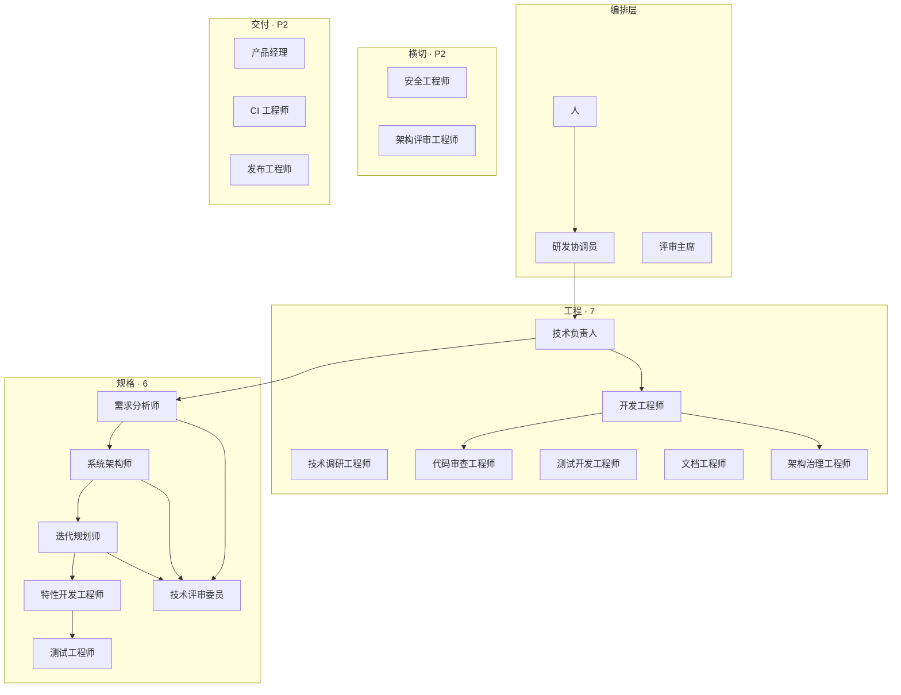

# Harness 研发团队 — 岗位体系

> **单源**：岗位名、对敲、委派说明 → [agents.registry.yaml](./agents.registry.yaml)（同步到仓库根 `config/agents.registry.yaml`）  
> **人格**：`souls/<role_id>/SOUL.md` · **流程图**：[swimlanes.md](./swimlanes.md) · **约定**：[principles.md](./principles.md)

本目录仅保留 **4 个文件** + registry；不再维护逐岗位子目录与重复 YAML。

## 本目录文件

| 文件 | 内容 |
|------|------|
| **README.md**（本文） | 编制、对敲、场景、研发协调员 |
| **agents.registry.yaml** | 机器可读蓝图（`title`、`adversary_of`、`description`…） |
| **swimlanes.md** | 泳道图 + SDD/日常文字流程 |
| **principles.md** | Soul/Mission、对敲、compile 格式、Cursor 内置 |

落地：`pnpm harness compile` · `pnpm harness validate-souls`

---

## 研发协调员（主会话）

非 subagent，无 `role_id`。

- 与你对话、按 registry 委派各岗位
- Spec 小改可做；大块逻辑走 `spec-*` 岗位
- SDD 各档文档并行产出后 **必须** 调 **技术评审委员**
- STOP / 模糊项升级 **人**

| 协调员可做 | 必须委派 |
|------------|----------|
| 格式、小字段 | 需求/设计/任务文档 |
| 汇总、选下一岗位 | 写代码、审查 |

---

## 组织图

---

## 全员表

| 岗位 | role_id | 层 | 阶段 | readonly |
|------|---------|-----|------|----------|
| 研发协调员 | — | 编排 | 始终 | — |
| 技术负责人 | orchestrator | 工程 | P1 | false |
| 技术调研工程师 | explore | 工程 | P1 | true |
| 开发工程师 | implementer | 工程 | P1 | false |
| 代码审查工程师 | reviewer | 工程 | P1 | true |
| 测试开发工程师 | test-writer | 工程 | P1 | false |
| 文档工程师 | doc-gardener | 工程 | P1 | true |
| 架构治理工程师 | harness-auditor | 工程 | P1 | true |
| 需求分析师 | spec-requirements | 规格 | P1 | false |
| 系统架构师 | spec-design | 规格 | P1 | false |
| 迭代规划师 | spec-tasks | 规格 | P1 | false |
| 特性开发工程师 | spec-impl | 规格 | P1 | false |
| 测试工程师 | spec-test | 规格 | P1 | false |
| 技术评审委员 | spec-judge | 规格 | P1 | true |
| 安全工程师 | security-reviewer | 横切 | P2 | true |
| 架构评审工程师 | architecture-reviewer | 横切 | P2 | true |
| 变更影响分析师 | impact-reviewer | 横切 | P2 | true |
| 可观测性工程师 | observability-reviewer | 横切 | P2 | true |
| 方案评审工程师 | solution-fit-challenger | 横切 | P2 | true |
| 产品经理 | product-clarifier | 交付 | P2 | false |
| CI 工程师 | ci-investigator | 交付 | P2 | true |
| 发布工程师 | pr-shepherd | 交付 | P2 | true |
| 评审主席 | moderator | 交付 | P2 | true |

P1：**13** 个 Soul；P2：**+9** 岗位槽（多数仅 Mission，无独立 Soul）。

---

## 对敲矩阵

`adversary_of` 在 registry 中用 **role_id**；裁决类型见 `debate_mode`。

### P1

| 岗位 | 对敲岗位 | 裁决 |
|------|----------|------|
| 代码审查工程师 | 开发工程师 | VALID / INVALID / AMBIGUOUS |
| 需求分析师 | 技术评审委员 | GO / REVISE / STOP |
| 系统架构师 | 技术评审委员、方案评审工程师(P2) | GO / REVISE / STOP |
| 迭代规划师 | 技术评审委员、开发工程师（预审） | GO / REVISE |
| 特性开发工程师 | 代码审查工程师、测试开发工程师 | findings 合并 |
| 技术负责人 | 技术评审委员、人 | HITL |
| 架构治理工程师 | 开发工程师 | kill-findings |
| 技术调研工程师 | 代码审查工程师 | 可复现 |

### P2

| 岗位 | 对敲岗位 |
|------|----------|
| 安全 / 架构 / 变更 / 可观测性工程师 | 开发工程师 |
| 方案评审工程师 | 系统架构师、开发工程师 |
| CI 工程师 | 开发工程师 |
| 发布工程师 | 代码审查工程师 |

**原则**：开发工程师不得自批代码；技术评审委员不写功能代码；评审主席只合成 finding。

---

## 场景默认流水线

| 场景 | 上场岗位 |
|------|----------|
| 模糊需求 | 产品经理 → 技术负责人 → 需求分析师 → 技术评审委员 |
| 新功能 | SDD 全链（见 swimlanes §1.1、§3）→ 代码审查 ↔ 开发工程师 → 架构治理 |
| 修 bug | 技术调研（可选）→ 开发工程师 → 测试开发 → 代码审查 |
| PR 放行 | 代码审查 ↔ 开发工程师 → 发布工程师 → CI 工程师 |

---

## 新增岗位

1. 在 [agents.registry.yaml](./agents.registry.yaml) 增加 `role_id`、`title`、`description`、`adversary_of`…  
2. 若 P1：新增 `souls/<role_id>/SOUL.md` 与 `templates/mission/<role_id>.mission.md`  
3. `pnpm harness compile` · `pnpm harness validate-souls`

单岗职责与「何时委派」以 registry 的 `description` 为准，勿再维护平行 markdown 页。
