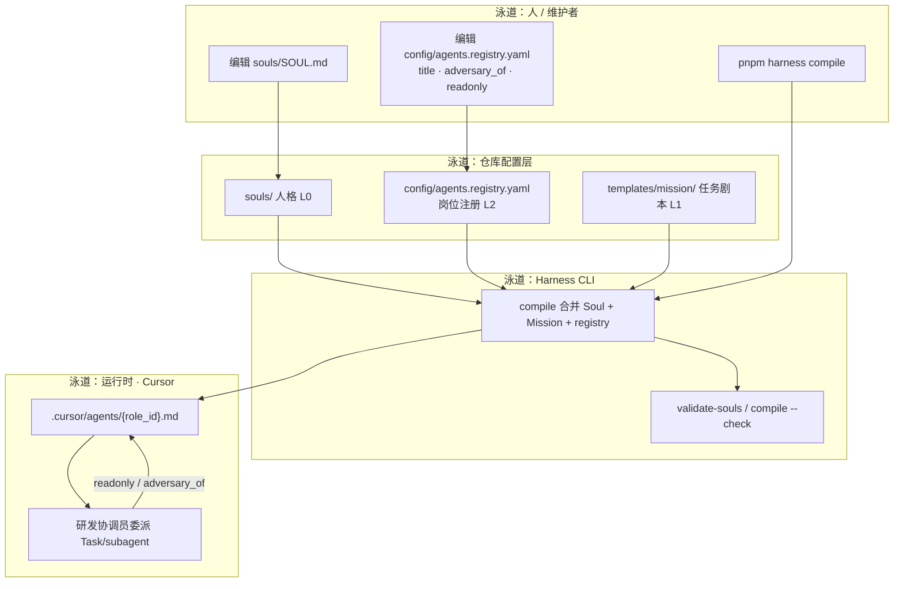
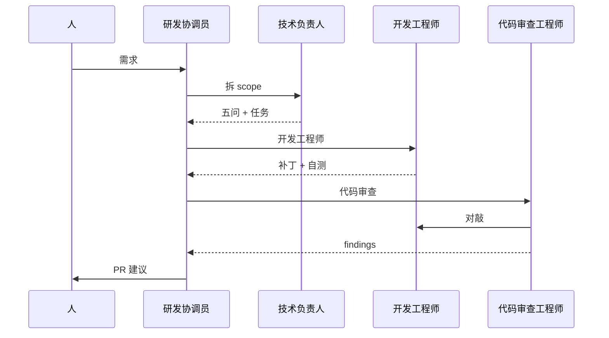
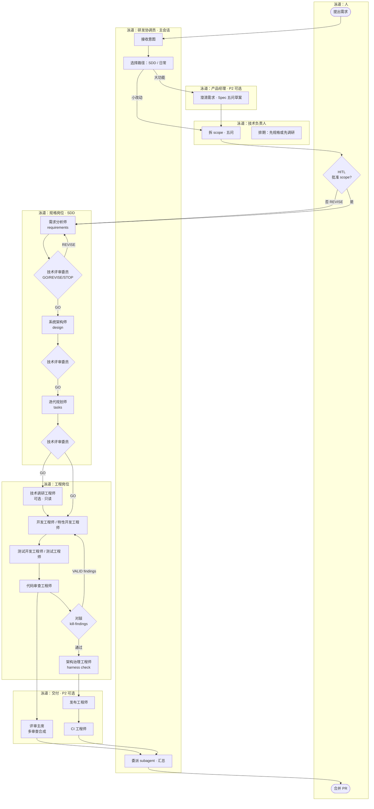
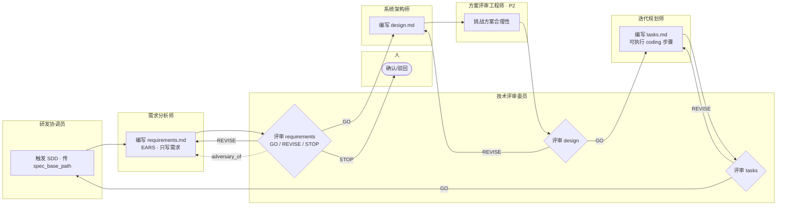
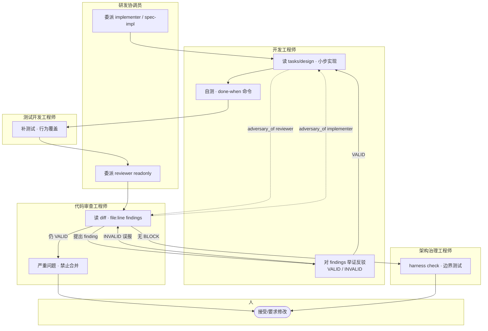
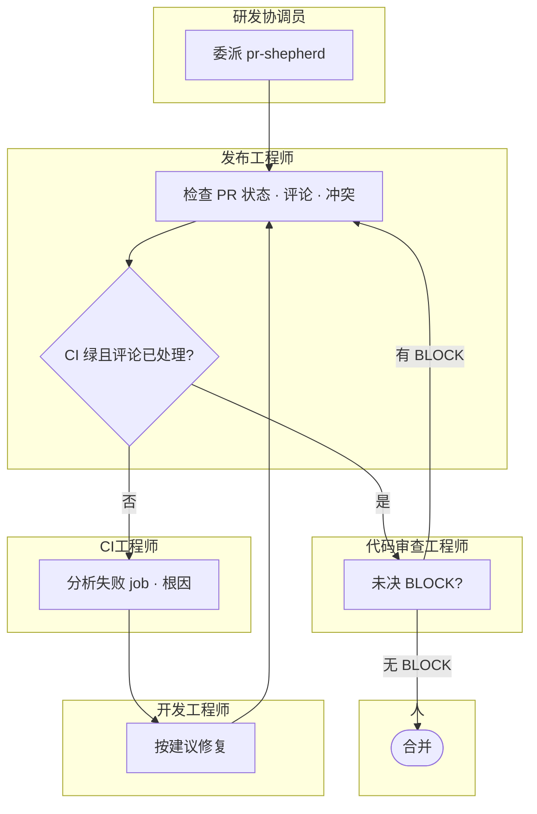

# Role 机制与流程（泳道图）

> 编制与对敲表：[README.md](./README.md) · 岗位元数据：[agents.registry.yaml](./agents.registry.yaml)  
> 泳道 = **谁**在处理；箭头 = **交接**；菱形 = **闸门**（技术评审委员 / 人）。

---

## 1. 机制总览：配置如何变成可委派岗位

说明 **role 机制本身**（不是业务需求流）：人格与花名册如何进入 IDE。



| 泳道 | 职责 |
|------|------|
| 人 / 维护者 | 改 Soul、registry，触发 compile |
| 仓库配置层 | 事实源：人格短、registry 定权限与对敲 |
| Harness CLI | 生成 agent 文件、校验不漂移 |
| 运行时 | 研发协调员按 `role_id` 委派；subagent 加载编译产物 |

`roles/` 下 **README + 本文 + principles** 为人读说明；不参与 compile。

---

## 1.1 SDD 与文字流程

**SDD**（Spec-Driven Development）：规格阶段 **每档文档后** 技术评审委员闸门（GO / REVISE / STOP）；实现阶段再测试与代码审查。评审 **不是** 只在项目末尾做一次。

### 规格阶段

```text
需求分析师 →〔技术评审委员〕→ 系统架构师 →〔技术评审委员〕→ 迭代规划师 →〔技术评审委员〕
```

### 实现阶段

```text
特性开发工程师 → 测试工程师 → 代码审查工程师 ↔ 开发工程师 → 架构治理工程师 → 人
```

### 一览

```text
需求 →[评审]→ 设计 →[评审]→ 任务 →[评审]→ 实现 → 测试 → 代码审查 → 治理检查 → 人
```

| 产物 | 路径 |
|------|------|
| 需求 / 设计 / 任务 | `docs/exec-plans/active/<domain>/<feature>/` 或 `.claude/specs/<feature>/*.md` |
| 契约 | [policy/spec-contract.md](../../policy/spec-contract.md)（Spec 五问） |
| Claude 提示词 | `.claude/agents/sdd/spec-*` |

### 日常开发（简图）



### 其它文字链

| 链 | 顺序 |
|----|------|
| 修 bug | 研发协调员 → 技术调研（可选）→ 开发工程师 → 代码审查工程师 |
| 交付 P2 | 开发工程师 → 测试开发 → 代码审查 ↔ 开发工程师 → 架构治理 → 发布 → CI → 人 |

---

## 2. 端到端：新功能（P1 + 可选 P2）

从模糊需求到可合并 PR 的 **主路径**（纵轴为时间从上到下）。



**读图要点**

- **研发协调员** 不写业务代码，只委派与汇总。
- **技术评审委员** 在规格链上出现 3 次闸门（需求 / 设计 / 任务），需求有问题在此 **STOP/REVISE**，不进入架构师。
- **代码审查工程师 ↔ 开发工程师** 在实现后 **对敲**，与规格闸门是两套 `debate_mode`（见 §5）。

---

## 3. SDD 规格泳道（仅文档阶段）

只展开 **requirements → design → tasks**，实现代码不在本图。



| 步骤 | 对敲（registry） | 产出 |
|------|------------------|------|
| 需求 | 需求分析师 ↔ **技术评审委员** | `requirements.md` |
| 设计 | 系统架构师 ↔ 技术评审委员、方案评审工程师(P2) | `design.md` |
| 任务 | 迭代规划师 ↔ 技术评审委员、开发工程师(预审) | `tasks.md` |

---

## 4. 实现与审查泳道（对敲 kill-findings）

规格通过后，**开发工程师** 与 **代码审查工程师** 的分工。



**规则（principles.md）**

1. 同一岗位 **不得** 既改代码又宣布可合并。  
2. 审查 **readonly**；修复委派回开发工程师。  
3. 架构治理工程师与开发工程师对敲 **分层/CI**，不替代代码审查。

---

## 5. 修 bug 最短泳道

```mermaid
flowchart LR
  subgraph 人
    u1([报 bug])
    u2([合并])
  end

  subgraph 研发协调员
    m1[委派]
  end

  subgraph 技术调研工程师
    ex[只读定位 · 可选]
  end

  subgraph 开发工程师
    fix[最小修复]
  end

  subgraph 代码审查工程师
    cr[审查 diff]
  end

  u1 --> m1
  m1 --> ex
  ex --> fix
  m1 --> fix
  fix --> cr
  cr --> u2
```



---

## 6. 交付泳道（P2）

PR 已创建后的 **发布工程师 / CI 工程师** 循环。



---

## 7. debate_mode 与泳道对应

| debate_mode | 典型泳道组合 | 结果 |
|-------------|--------------|------|
| **judge-verdict** | 需求/设计/任务岗位 → **技术评审委员** | GO / REVISE / STOP |
| **kill-findings** | **代码审查工程师** ↔ **开发工程师** | VALID / INVALID / AMBIGUOUS |
| **cross-exam** | 测试开发 ↔ 审查；发布 ↔ 审查 | 多视角 validate/challenge |
| **judge-verdict** | **产品经理** ↔ **技术负责人** | scope 收敛后人批 |

---

## 8. 何时走哪条泳道

| 场景 | 建议泳道图 |
|------|------------|
| 理解配置与 compile | §1 机制总览 |
| 新功能、怕需求错 | §2 端到端 + §3 SDD |
| 只关心需求审核 | §3（技术评审委员闸门） |
| 实现与 CR | §4 |
| 小修复 | §5 |
| PR 合不进 | §6 |

---

## 9. 相关文档

- [README.md](./README.md) — 编制表、对敲矩阵、场景流水线  
- [principles.md](./principles.md) — Soul / Mission / compile / 内置 subagent  
- [agents.registry.yaml](./agents.registry.yaml) — 岗位单源（同步 `config/agents.registry.yaml`）  
