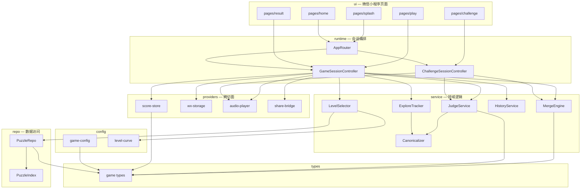
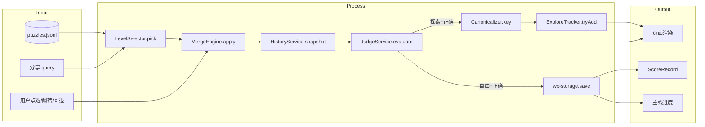
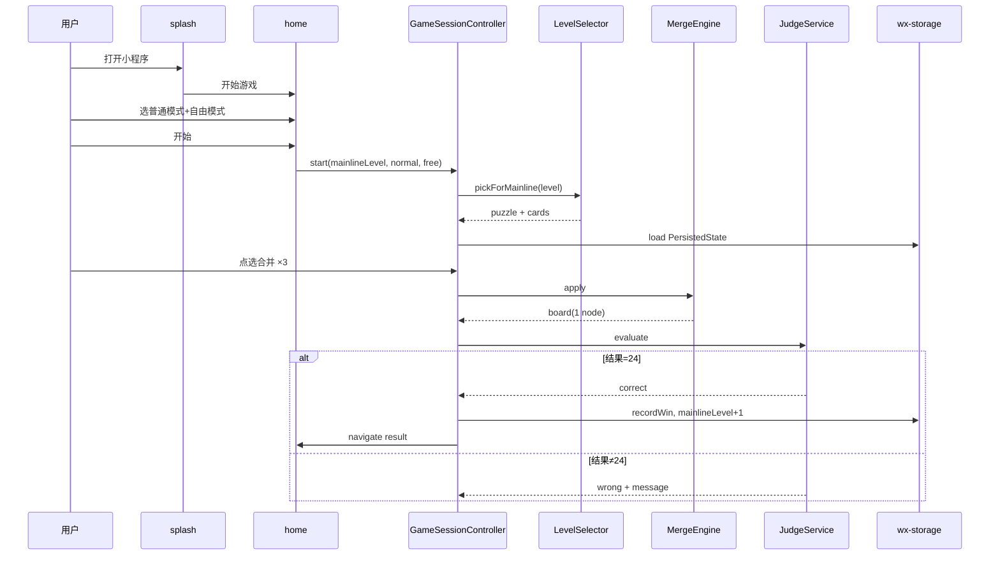
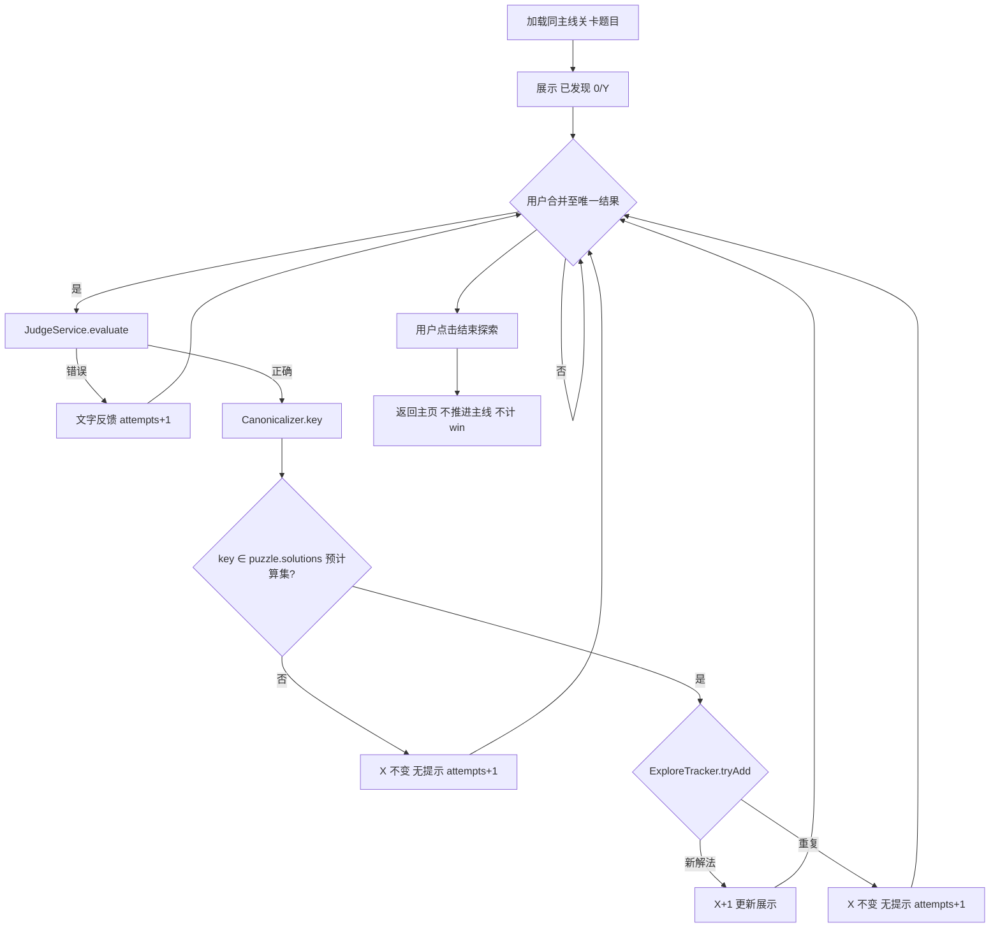
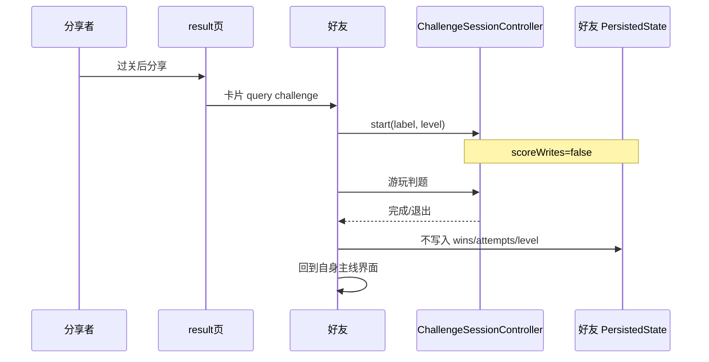
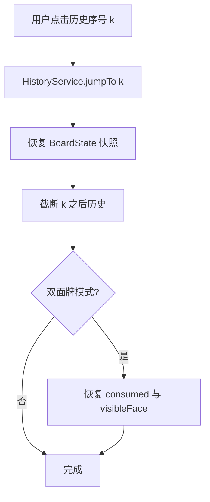
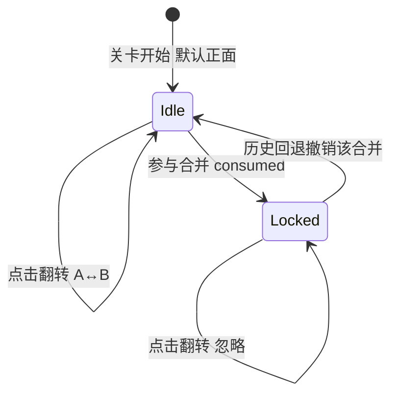

# Design Document: game24 MVP

> 基于 `requirements.md` v1.4，与 `spec.md` v1.3 五问对齐。

## Overview

### 设计目标

将微信小程序「24 点」MVP 交付为**纯前端**应用：玩家从进入页进入主页，正交选择**游戏模式**（1–10 普通 / 双面牌）与**玩法**（自由 / 探索），在主线进度关卡上点选合并四张牌凑 24；唯一最终结果时自动判题；自由模式过关推进主线并分享挑战关卡；探索模式展示「已发现 X / Y」且可随时结束；本地持久化 `ScoreRecord` 与主线进度。

### 范围边界

| 纳入 | 排除（v1） |
|------|------------|
| 进入页、主页、做题页、结果页、挑战落地页 | 登录 / openid |
| 普通 + 双面牌模式 | 好友对战 / PK / 榜单 |
| 自由 + 探索玩法 | 云端 API、统计重置 |
| 操作历史跳转回退、音效、计时 | 跨关错题本、分步提示 |
| 微信好友分享 → 挑战关卡模式 | 分享局内半题状态 |

### 关键技术决策

| 决策 | 选择 | 理由 |
|------|------|------|
| 数值运算 | 有理数（`Rational`：分子/分母大整数） | 与 `solve_all.py` 的 `Fraction` 一致，避免浮点误差；满足「除法可非整除」 |
| 等于 24 判定 | `value.num === 24 && value.den === 1` | 精确判题，无 epsilon |
| 解法归一化 | 移植 `solve_all.py` 的 `canonical_form` / `canonical_key` | Req 16 §10 冻结契约；黄金测试可对照 `puzzles.jsonl` |
| 题库加载 | 构建期或启动期解析 `data/puzzles.jsonl` 为内存索引 | 1820 行体量可全量加载；按 `solution_count` 分桶选题 |
| 双面牌背面 | `faceA` = 题库四数；`faceB` = 确定性种子 PRNG(关卡号, 牌位) ∈ [1,10] | 与普通模式共用同一套关卡选题与成长曲线；翻转由玩家探索 |
| 持久化 | `providers/wx-storage` 封装 `wx.setStorageSync` | 分层约束：UI/runtime 不直接调微信 API |
| 挑战会话 | 独立 `ChallengeSession`，`scoreWrites: false` | 好友进度与 `ScoreRecord` 隔离（Req 13–14） |
| 测试 | Vitest 覆盖 service 纯逻辑 + 黄金归一化 | 不依赖微信运行时；`pnpm harness check` 可跑 |

---

## Architecture Design

### 系统架构图



### 数据流图



### 分层依赖（冻结）

遵守 `policy/layers.yaml` → `game24`：

```text
types → config → repo → service → runtime → ui
providers → types, config only
```

| 层 | 目录 | 可 import |
|----|------|-----------|
| types | `src/types/` | — |
| config | `src/config/` | types |
| repo | `src/repo/` | types, config |
| service | `src/service/` | types, config, repo |
| runtime | `src/runtime/` | types, config, repo, service |
| ui | `src/ui/` 或 `miniprogram/pages/` | 全下层（经 runtime 编排为主） |
| providers | `src/providers/` | types, config |

**禁止**：`service` import `runtime`/`ui`；`providers` import `service`；页面直接调用 `wx.*`（须经 providers）。

---

## Component Design

### types — `src/types/game.ts`

**职责**：冻结契约类型，零运行时依赖。

**核心接口**：

```typescript
/** 冻结：Req 13, 16 §3 */
export type ScoreRecord = { wins: number; attempts: number };

export type GameMode = "normal" | "dual-face";
export type PlayMode = "free" | "explore";
export type Operator = "+" | "-" | "×" | "÷";

export type Rational = { num: number; den: number }; // 恒约分，den > 0

/** 合并树节点：叶子为牌或中间结果 */
export type ExprNode =
  | { kind: "num"; value: Rational; sourceCardId?: string }
  | { kind: "+"; left: ExprNode; right: ExprNode }
  | { kind: "-"; left: ExprNode; right: ExprNode }
  | { kind: "×"; left: ExprNode; right: ExprNode }
  | { kind: "÷"; left: ExprNode; right: ExprNode };

export type PhysicalCard = {
  id: string;
  faceA: number;
  faceB: number;
  visibleFace: "A" | "B";
  consumed: boolean;
  expr: ExprNode; // 当前子树
};

export type HistoryStep = {
  index: number;
  label: string;       // ① `1+2=3`
  board: BoardState;
};

export type BoardState = {
  nodes: ExprNode[];   // 场上可合并对象（1–4 个）
  cards: PhysicalCard[];
};

export type PuzzleRecord = {
  cards: number[];
  cards_label: string;
  solution_count: number;
  min_steps: number | null;
  solutions: string[];
};

export type LevelTier = "novice" | "standard" | "expert";

export type SessionKind = "mainline" | "challenge";

export type GameSessionMeta = {
  kind: SessionKind;
  gameMode: GameMode;
  playMode: PlayMode;      // challenge 固定为 free 规则
  levelNumber: number;
  puzzle: PuzzleRecord;
  hintUsed: boolean;
  startedAt: number;
  scoreWrites: boolean;    // challenge = false
  progressWrites: boolean; // challenge = false
};
```

**追溯**：Req 2–4, 6, 13, 16 §1–4

---

### config — `src/config/`

| 模块 | 职责 |
|------|------|
| `game-config.ts` | 运算符列表、牌面范围 1–10、双面牌 B 面生成种子盐值 |
| `level-curve.ts` | 关卡阶段边界：1–20 新手、21–80 普通、81+ 高手；`tierForLevel(n)` |
| `storage-keys.ts` | `STORAGE_SCORE`, `STORAGE_PROGRESS`, `STORAGE_PREFS` 键名 |

**选题分桶规则**（与 `tools/README.md` 对齐，v1.3 删除大师关 `min_steps` 约束）：

| 阶段 | 关卡 | `solution_count` | 普通模式附加过滤 |
|------|------|------------------|------------------|
| 新手 | 1–20 | ≥ 5 | `cards` 全 ≤ 10 |
| 普通 | 21–80 | 2–4（含） | 同上 |
| 高手 | 81+ | = 1 | 同上 |

双面牌模式：**选题与普通模式相同**（同一 `PuzzleRecord`），仅牌面呈现与翻转交互不同（Req 3.9）。

**追溯**：Req 5, 16 §11

---

### repo — `src/repo/`

#### `PuzzleRepo`

- **职责**：加载并查询 `packages/game24-miniprogram/data/puzzles.jsonl`。
- **接口**：
  - `loadAll(): PuzzleRecord[]`
  - `getByLabel(label: string): PuzzleRecord | undefined`
- **依赖**：types, config

#### `PuzzleIndex`（构建于首次 `loadAll` 后）

- **职责**：按 `LevelTier` + `solution_count` 预分桶，加速 `LevelSelector`。
- **接口**：
  - `bucket(tier: LevelTier, count: number): PuzzleRecord[]`
  - `normalModePool(tier: LevelTier): PuzzleRecord[]` — 已过滤 `cards ⊆ [1,10]` 且 `solution_count > 0`
- **实现要点**：启动时一次性索引；关卡 N 用 `levelNumber` 确定性选取 `pool[(N - 1) % pool.length]`，保证可复现。

**追溯**：Req 5.5–5.9, 16 §11

---

### service — `src/service/`

#### `RationalMath`

- `add/sub/mul/div(a, b): Rational`
- `equals24(v): boolean`
- `fromInt(n): Rational`

#### `MergeEngine`

- **职责**：点选两对象 + 运算符 → 新 `ExprNode`；更新 `BoardState`；双面牌标记 `consumed`。
- **接口**：
  - `canMerge(board, idA, idB, op): boolean`
  - `apply(board, idA, idB, op): BoardState`
  - `remainingCount(board): number`
- **规则**：仅 `+ - × ÷`；运算值取当前可见面（双面牌）；合并后子树内牌 `consumed = true`，禁止翻转（Req 3.5–3.7）。

#### `HistoryService`

- **职责**：维护 `HistoryStep[]`；跳转回退截断后续步骤。
- **接口**：
  - `append(steps, board, label): HistoryStep[]`
  - `jumpTo(steps, index): { steps, board }`
- **回退**：恢复 `BoardState` 快照（含 `consumed`、可见面、Expr 子树）；与 `MergeEngine` 快照序列化一致（Req 7）。

#### `Canonicalizer`

- **职责**：将 `ExprNode` 转为 `canonical_key`（与 Python `repr(canonical_form())` 一致）。
- **接口**：
  - `canonicalForm(node: ExprNode): CanForm`
  - `canonicalKey(node: ExprNode): string`
  - `canonicalDisplay(node: ExprNode): string` — 用于「?」答案展示
- **算法**（冻结，与 `solve_all.py` 对齐）：
  1. `+`：展平结合律，`flatten_addends`，子项 `canonical_form` 后排序
  2. `×`：展平结合律，`flatten_factors`，子项排序
  3. `-` / `÷`：保持左右顺序，不交换
  4. 叶子：`("n", Rational)`

#### `JudgeService`

- **职责**：场上仅剩 1 个节点时自动判题（Req 6.5–6.7）。
- **接口**：
  - `shouldAutoJudge(board): boolean` — `remainingCount === 1`
  - `evaluate(board, meta): JudgeResult`
- **`JudgeResult`**：

```typescript
type JudgeResult =
  | { outcome: "pending" }
  | { outcome: "wrong"; message: string; countAttempt: true }
  | { outcome: "correct"; canonicalKey: string; display: string; countAttempt: true }
  | { outcome: "invalid-usage"; message: string } // 双面牌四牌各用一次校验失败
```

- **正确判定**：`equals24(root.value)` 且四张物理牌各用一次（双面牌校验每牌恰好一面参与，Req 3.8）。
- **分流**：由 `runtime` 根据 `playMode` 处理（自由过关 / 探索计数）。

#### `ExploreTracker`

- **职责**：维护本会话 `discoveredKeys: Set<string>`；`X = discoveredKeys.size`，`Y = puzzle.solution_count`。
- **接口**：
  - `tryAdd(key, puzzle): { added: boolean; x: number; reason?: "duplicate" | "not-in-puzzle-set" | "at-cap" }`
  - `getProgress(): { x: number; y: number }`
  - `buildSolutionKeySet(puzzle): Set<string>` — 启动时由 `puzzle.solutions[]` 经 `Canonicalizer.canonicalKey` 预构建
- **计数规则（冻结，满足 Req 16 §10 `X ≤ solution_count`）**：
  1. 仅当 `canonicalKey ∈ buildSolutionKeySet(puzzle)` 时，才视为「本题可计数的发现」；
  2. 若 key 不在预计算集合内（典型：双面牌翻转后四元组 ≠ `puzzle.cards`）→ 判题仍可反馈「算对了」，但 **X 不变**，`reason: "not-in-puzzle-set"`；
  3. 若 key 已在 `discoveredKeys` → `added: false`，`reason: "duplicate"`（Req 9.8）；
  4. 若 `discoveredKeys.size >= puzzle.solution_count` → 拒绝新增，`reason: "at-cap"`（防御性兜底，与 1 等价）。
- **双面牌 + 探索**：进度规则与普通模式相同（展示「已发现 X / Y」），但 Y 始终为 `puzzle.solution_count`（faceA 四元组）；玩家用 faceB 凑出 24 属合法运算，不计入 X。
- **重复解法**：`added === false`（含 duplicate / not-in-puzzle-set），仍计 attempt（Req 9.8）；无额外 UI 提示。

#### `LevelSelector`

- **接口**：
  - `pickForMainline(levelNumber, gameMode): { puzzle, cards: PhysicalCard[] }`
  - `pickForChallenge(levelNumber, sharedLabel?): { puzzle, cards }` — 分享落地用 `cards_label` 精确定位题目
- **双面牌**：`faceA[i] = puzzle.cards[i]`；`faceB[i] = seededPick(levelNumber, i)` ∈ [1,10]。

#### `HintService`

- **接口**：`showAnswer(puzzle, cards?: PhysicalCard[]): string[]` — 从 `puzzle.solutions` 取展示。
- **双面牌答案格式**（Req 3 edge case）：在算式中标注面，例如 `3(A)×8(B)×(9(A)−7(B))=24`；无双面牌时直接展示 `puzzle.solutions` 原文。
- **副作用**：仅置 `hintUsed = true`，不修改探索 X（Req 10）。

**追溯**：Req 3, 6–11, 16 §5–10

---

### providers — `src/providers/`

| 模块 | 职责 | 接口 |
|------|------|------|
| `score-store` | 内存 + 持久化 `ScoreRecord` | `loadScore()`, `recordWin()`, `recordAttempt()`, 无 `reset` 导出（v1） |
| `wx-storage` | 读写本地存储 | `get<T>(key)`, `set(key, value)`, `safeGet` 失败返回 default |
| `audio-player` | 音效 | `play(event: SoundEvent)`, 失败静默 |
| `share-bridge` | 分享参数 | `buildSharePath(level, label)`, `parseEntryQuery(query)` |

**持久化结构**：

```typescript
type PersistedState = {
  score: ScoreRecord;
  mainlineLevel: number;        // 下一关待玩序号，初始 1
  prefs: { gameMode?: GameMode; playMode?: PlayMode };
};
```

**降级策略**（Req 17 edge case）：

| 失败场景 | 行为 |
|----------|------|
| `wx.storage` 读失败 | 使用 `{ score: {0,0}, mainlineLevel: 1, prefs: {} }`；console 告警 |
| `wx.storage` 写失败 | 内存态继续；本关可玩；下次打开可能丢失 — 不阻断玩法 |
| 音效不可用 | `audio-player` no-op |

**追溯**：Req 12–13, 16 §2–3, 8

---

### runtime — `src/runtime/`

#### `AppRouter`

- 解析启动参数：正常启动 → splash → home；分享 `query.mode=challenge&level=&label=` → challenge 页。
- 不写入好友 `PersistedState`（Req 14）。

#### `GameSessionController`

- **职责**：单局状态机，连接 service 与 providers。
- **状态**：`meta`, `board`, `history`, `explore`, `elapsed`, `phase: playing | judged | finished`
- **关键方法**：
  - `start(level, gameMode, playMode)`
  - `onMerge(idA, idB, op)` → 动画指令 + 历史 + 若 `shouldAutoJudge` 则 `onAutoJudge`
  - `onFlip(cardId)` — 双面牌；已 consumed 拒绝
  - `onHistoryJump(index)`
  - `onHint()`
  - `onEndExplore()` — 探索模式返回主页
  - `onFreeWinComplete()` — 写 win/attempt、推进 `mainlineLevel`、导航 result
- **计分规则**：
  - `scoreWrites === true`：自由过关 `recordWin` + `recordAttempt`；探索每次判题 `recordAttempt`；错误判题 `recordAttempt`
  - `scoreWrites === false`（挑战）：全部跳过

#### `ChallengeSessionController`

- 复用 `GameSessionController` 内核，`meta.scoreWrites = false`，`playMode = free`。
- **退出 affordance**（Req 14.4）：挑战页提供「退出挑战」按钮；系统返回键等效退出。
- 完成（过关或失败重试后放弃）/ 主动退出 → 导航回好友 `mainlineLevel` 对应主页，不修改存储。

**追溯**：Req 1, 7–9, 13–14

---

### ui — 微信小程序页面

| 页面 | 路径 | 职责 |
|------|------|------|
| 进入页 | `pages/splash` | 无登录；「开始游戏」→ home |
| 主页 | `pages/home` | 模式/玩法二选一；展示主线关卡号、胜率；开始验证已选 |
| 做题页 | `pages/play` | 牌面、合并、历史列表、计时、音效、「?」、探索「已发现 X/Y」+「结束探索」 |
| 结果页 | `pages/result` | 自由模式过关；`hintUsed` 文案；本关耗时 `elapsed`；分享入口（仅此页） |
| 挑战页 | `pages/challenge` | 标题含「挑战关卡」；无分享；无探索进度；「退出挑战」返回好友主页（Req 14.4 主动退出） |

**UI 约束**：

- 分享入口**仅**结果页（Req 1.5）
- 探索模式**禁止**星形图标（Req 9.2）
- 自由模式做题页**不展示** X/Y（Req 8.4）
- 无「提交」按钮（Req 6.5）

页面通过 `runtime` 控制器交互；`ui` 层 TS 逻辑放 `src/ui/bindings/`，WXML 事件转发。

**追溯**：Req 1–4, 8–12, 14–15

---

## Data Model

### 题库记录（`puzzles.jsonl`）

每行 JSON（运行时只读）：

```json
{
  "cards": [1, 1, 2, 6],
  "cards_label": "1,1,2,6",
  "solution_count": 2,
  "min_steps": 3,
  "solutions": ["((1+1)×2×6)", "((1+1+2)×6)"]
}
```

| 字段 | 用途 |
|------|------|
| `cards` | 普通模式四张牌面；双面牌 `faceA` |
| `cards_label` | 分享落地定位题目 |
| `solution_count` | 探索模式 Y；选题分桶 |
| `solutions` | 「?」答案；黄金测试对照 |
| `min_steps` | v1 **不用于**选题（v1.3 已删除大师关约束） |

**数据规模**（`puzzles.summary.txt`）：1820 组合，1362 有解；普通模式过滤 `cards ≤ 10` 后池子见 `PuzzleIndex` 构建日志。

### 会话与持久化 ER

```mermaid
erDiagram
    PersistedState ||--|| ScoreRecord : contains
    PersistedState ||--|o UserPrefs : contains
    GameSessionMeta ||--|| PuzzleRecord : references
    GameSessionMeta ||--o ExploreState : optional
    BoardState ||--|{ PhysicalCard : contains
    BoardState ||--|{ ExprNode : contains
    HistoryStep ||--|| BoardState : snapshots

    ScoreRecord {
        number wins
        number attempts
    }
    UserPrefs {
        GameMode gameMode
        PlayMode playMode
    }
    ExploreState {
        set discoveredKeys
        number y
    }
```

---

## Business Process

### 流程 1：冷启动 → 自由模式主线闯关



**追溯**：Req 1, 2, 4, 5, 6, 8, 13

---

### 流程 2：探索模式 — 发现解法



**追溯**：Req 5.10, 9, 11

---

### 流程 3：分享 → 好友挑战关卡



**追溯**：Req 14, 16 §8

---

### 流程 4：操作历史跳转回退



**追溯**：Req 7, 3.6

---

### 流程 5：双面牌翻转



**追溯**：Req 3

---

## Error Handling Strategy

| 场景 | 检测 | 处理 | 需求 |
|------|------|------|------|
| 未选模式/玩法点开始 | home 校验 | Toast 提示，阻止导航 | Req 2.3, 4.4 |
| 合并对象不合法 | `canMerge` false | 忽略或轻提示 | Req 6 |
| 判题错误 | `outcome: wrong` | 文字反馈；自由不推进；探索 X 不变 | Req 6.7, 9.10 |
| 双面牌未四牌各用一次 | `invalid-usage` | 文字说明；不算过关 | Req 3.8 |
| 探索重复解法 | `tryAdd` false | 静默；attempts+1 | Req 9.8 |
| 探索：算对但 key ∉ puzzle.solutions 集 | 双面牌 faceB 等 | 文字反馈「算对了」；X 不变；attempts+1 | Req 16 §10, 3 edge |
| 音效失败 | audio catch | 继续游戏 | Req 12.4 |
| 存储读写失败 | wx-storage try/catch | 默认态 + 告警 | Edge case |
| 题库无匹配分桶 | `pick` 空池 | 回退邻近 tier 池（仅开发期告警）；生产构建时验证池非空 | Req 5.5 |
| 归一化不一致 | 黄金测试失败 | CI 阻塞 | Req 16 §10 |

---

## Testing Strategy

### 单元测试（Vitest，`packages/game24-miniprogram`）

| 套件 | 覆盖 |
|------|------|
| `rational-math.test.ts` | 四则、除零、equals24 |
| `merge-engine.test.ts` | 合并顺序、双面牌 consumed |
| `canonicalizer.test.ts` | **黄金测试**：抽样 `puzzles.jsonl` 的 `solutions[]`，重建表达式树，`canonicalKey` 与 Python `canonical_key` 一致 |
| `level-selector.test.ts` | 各 tier 分桶约束 |
| `explore-tracker.test.ts` | 重复 key 不计 X；key ∉ puzzle.solutions 集不计 X；`X ≤ solution_count` 恒成立 |
| `judge-service.test.ts` | 唯一结果触发；多对象不触发 |

### 边界测试

- `pnpm test:boundary`：分层 import 无违规

### 人工验收（Req 17.6）

微信开发者工具完整路径：进入页 → 选模式与自由模式 → 按序闯关 → 自动判题过关 → 结果页分享 → 好友挑战往返；单独验证探索「已发现 X/Y」与结束探索。

---

## 冻结契约覆盖（Requirement 16）

| § | 契约 | 设计落点 |
|---|------|----------|
| 1 | 分层 `types→…→ui` | 上文架构图与目录；`test:boundary` |
| 2 | 跨切面仅 `providers/` | wx-storage、score-store、audio、share |
| 3 | `ScoreRecord { wins, attempts }` | `types/game.ts`；无 reset API |
| 4 | 模式×玩法正交 | `GameMode` + `PlayMode`；home 独立选择 |
| 5 | 自由模式：一解过关、推进主线、计 win | `GameSessionController.onFreeWinComplete` |
| 6 | 探索：X/Y、无星、不推进、可结束、不计 win | `ExploreTracker` + play 页 UI 约束 |
| 7 | 「?」：`hintUsed`、结果页展示、不增 X | `HintService` + result 页 |
| 8 | 分享：挑战模式、不改好友进度/统计 | `ChallengeSessionController` + `scoreWrites` |
| 9 | 自动判题：唯一最终结果 | `JudgeService.shouldAutoJudge` |
| 10 | 归一化与 `solve_all.py` 一致 + 黄金测试；`X ≤ solution_count` | `Canonicalizer` + `ExploreTracker.buildSolutionKeySet` / 计数规则 + `canonicalizer.test.ts` |
| 11 | 选题来自 `puzzles.jsonl` + 成长曲线 | `PuzzleRepo` + `LevelSelector` + `level-curve.ts` |

---

## 需求追溯矩阵

| 需求 | 设计章节 |
|------|----------|
| Req 1 进入页与导航 | ui 页面表、AppRouter、结果页分享约束 |
| Req 2 游戏模式选择 | types `GameMode`、home、PersistedState.prefs |
| Req 3 双面牌 | PhysicalCard、MergeEngine、翻转状态机 |
| Req 4 玩法选择 | types `PlayMode`、home |
| Req 5 关卡与成长曲线 | config/level-curve、PuzzleIndex、LevelSelector |
| Req 6 核心玩法与自动判题 | MergeEngine、JudgeService、RationalMath |
| Req 7 操作历史回退 | HistoryService、流程 4 |
| Req 8 自由模式 | GameSessionController 过关分支 |
| Req 9 探索模式 | ExploreTracker、流程 2 |
| Req 10 「?」提示 | HintService、hintUsed |
| Req 11 判题反馈 | JudgeResult、UI 文案 |
| Req 12 音效计时 | audio-player、会话 `startedAt/elapsed` |
| Req 13 本地持久化 | score-store、wx-storage、PersistedState |
| Req 14 分享挑战 | share-bridge、ChallengeSessionController、流程 3 |
| Req 15 v1 排除 | Overview 范围边界 |
| Req 16 架构契约 | 分层图、冻结契约表 |
| Req 17 非功能 | Testing Strategy、降级策略 |

---

## 实现目录结构（建议）

```text
packages/game24-miniprogram/
├── data/
│   ├── puzzles.jsonl
│   └── puzzles.summary.txt
├── tools/
│   └── solve_all.py
├── miniprogram/                 # 微信工程壳
│   ├── app.json
│   └── pages/{splash,home,play,result,challenge}/
├── src/
│   ├── types/game.ts
│   ├── config/{game-config,level-curve,storage-keys}.ts
│   ├── repo/{puzzle-repo,puzzle-index}.ts
│   ├── service/
│   │   ├── rational-math.ts
│   │   ├── merge-engine.ts
│   │   ├── history-service.ts
│   │   ├── canonicalizer.ts
│   │   ├── judge-service.ts
│   │   ├── explore-tracker.ts
│   │   ├── level-selector.ts
│   │   └── hint-service.ts
│   ├── providers/
│   │   ├── score-store.ts
│   │   ├── wx-storage.ts
│   │   ├── audio-player.ts
│   │   └── share-bridge.ts
│   ├── runtime/
│   │   ├── app-router.ts
│   │   ├── game-session-controller.ts
│   │   └── challenge-session-controller.ts
│   └── ui/bindings/             # 页面事件绑定
└── package.json
```

---

## 开放问题（实现前确认）

| # | 问题 | 建议默认 |
|---|------|----------|
| 1 | 微信基础库具体版本号 | 使用开发者工具创建项目时选当前稳定版；写入 `project.config.json` |
| 2 | UI 参考稿路径 | 实现阶段由 ui 层对照设计稿验收（Req 17.3） |
| 3 | 双面牌 `faceB` 生成是否需保证「存在某组翻面仍有解」 | v1 不保证；仅保证默认正面有解；faceB 凑出 24 不计入探索 X（见 ExploreTracker 计数规则） |

---

*文档版本：v1.1（对应 requirements v1.4；修订 D-1 探索计数边界、D-2–D-5）。待 spec-judge 复审后进入 tasks 阶段。*
