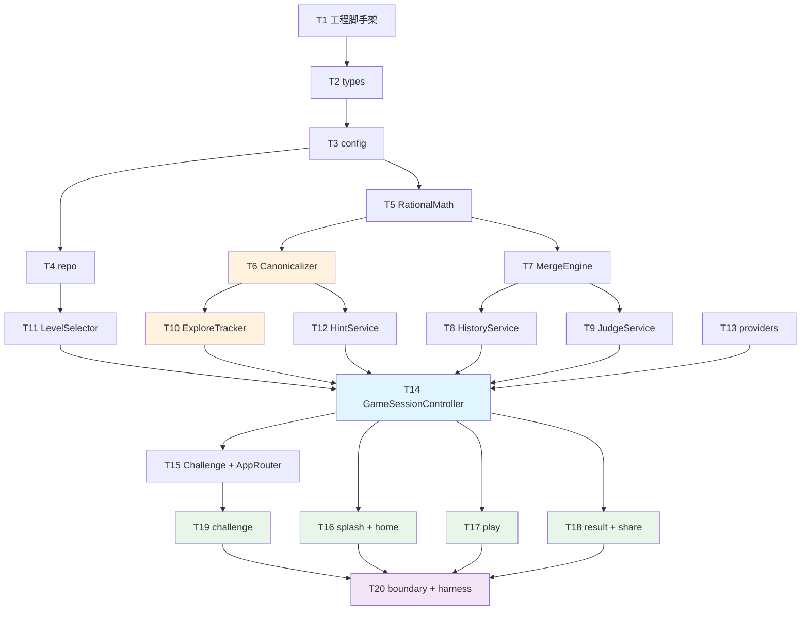

# Implementation Plan: game24 MVP

> 基于 `design.md` v1.1 拆解。实现前须经 **spec-judge** 批准。

## 并行度说明

| DAG | 含义 |
|-----|------|
| 0 | 无前置，可立即开始 |
| N | 依赖 DAG < N 的全部任务完成 |

同 DAG 编号内、无文件写冲突的任务可由 spec-impl / spec-test 并行执行。

---

## 任务清单

- [x] **T1** [DAG:0] 工程脚手架与测试基座
  - 创建 `packages/game24-miniprogram/package.json`（vitest、typescript、type: module）
  - 添加 `tsconfig.json`；根 `pnpm-workspace.yaml` 纳入本包
  - 创建 `miniprogram/` 微信工程壳：`app.json`、`app.ts`、`project.config.json`（基础库选当前稳定版）
  - 注册五页路由：`splash`、`home`、`play`、`result`、`challenge`
  - _设计追溯：design §实现目录结构_
  - _需求：Req 1.1–1.2, Req 16.1, Req 17.1–17.2, Req 17.4_
  - **完成条件**：`pnpm install && pnpm --filter game24-miniprogram test` 退出码 0（空套件可）

- [x] **T2** [DAG:1] 冻结类型层 `src/types/game.ts`
  - 实现 `ScoreRecord`、`GameMode`、`PlayMode`、`Operator`、`Rational`、`ExprNode`、`PhysicalCard`、`BoardState`、`HistoryStep`、`PuzzleRecord`、`LevelTier`、`SessionKind`、`GameSessionMeta`
  - 修复既有 `score-store.ts` 的 import 路径使其可编译
  - _设计追溯：design §types_
  - _需求：Req 16.3–16.4, Req 3, Req 6_
  - **完成条件**：`pnpm --filter game24-miniprogram exec tsc --noEmit` 通过

- [x] **T3** [DAG:2] 配置层 `src/config/`
  - 实现 `game-config.ts`（运算符、牌面范围 1–10、双面牌 faceB 种子盐值）
  - 实现 `level-curve.ts`（`tierForLevel`：新手 1–20、普通 21–80、高手 81+）
  - 实现 `storage-keys.ts`（`STORAGE_SCORE`、`STORAGE_PROGRESS`、`STORAGE_PREFS`）
  - _设计追溯：design §config_
  - _需求：Req 5.6–5.9, Req 5.12, Req 16.11_
  - **完成条件**：`pnpm --filter game24-miniprogram test -- level-curve` 通过（需新建 `level-curve.test.ts`）

- [x] **T4** [DAG:3] 题库仓库 `src/repo/puzzle-repo.ts` + `puzzle-index.ts`
  - `PuzzleRepo.loadAll()` / `getByLabel()` 解析 `data/puzzles.jsonl`
  - `PuzzleIndex` 按 `LevelTier` + `solution_count` 分桶；`normalModePool` 过滤 `cards ⊆ [1,10]`
  - 关卡 N 确定性选题：`pool[(N-1) % pool.length]`
  - _设计追溯：design §repo_
  - _需求：Req 5.5–5.9, Req 5.12, Req 16.11_
  - **完成条件**：`pnpm --filter game24-miniprogram test -- puzzle` 通过

- [x] **T5** [DAG:3] 有理数运算 `src/service/rational-math.ts`
  - 实现 `add/sub/mul/div`、`fromInt`、`equals24`（`num===24 && den===1`）
  - 恒约分、`den > 0`；除零抛错
  - _设计追溯：design §RationalMath_
  - _需求：Req 6.4, Req 6.7, Req 17 edge「除法产生小数」_
  - **完成条件**：`pnpm --filter game24-miniprogram test -- rational-math` 通过

- [x] **T6** [DAG:4] 解法归一化 `src/service/canonicalizer.ts` + 黄金测试
  - 移植 `tools/solve_all.py` 的 `canonical_form` / `canonical_key` 算法
  - 实现 `canonicalDisplay` 供「?」答案展示
  - 黄金测试：抽样 `puzzles.jsonl` 的 `solutions[]`，`canonicalKey` 与 Python 输出一致
  - _设计追溯：design §Canonicalizer, §Testing Strategy_
  - _需求：Req 9.8–9.9, Req 16.10_
  - **完成条件**：`pnpm --filter game24-miniprogram test -- canonicalizer` 全绿

- [x] **T7** [DAG:4] 合并引擎 `src/service/merge-engine.ts`
  - 实现 `canMerge`、`apply`、`remainingCount`
  - 双面牌合并后 `consumed=true`；运算取当前可见面
  - _设计追溯：design §MergeEngine_
  - _需求：Req 3.5–3.7, Req 6.1–6.3_
  - **完成条件**：`pnpm --filter game24-miniprogram test -- merge-engine` 通过

- [x] **T8** [DAG:5] 操作历史 `src/service/history-service.ts`
  - 实现 `append`、`jumpTo`；快照含 `consumed`、`visibleFace`、Expr 子树
  - 跳转回退截断后续步骤
  - _设计追溯：design §HistoryService, §流程 4_
  - _需求：Req 7.2–7.5, Req 7.7, Req 3.6_
  - **完成条件**：`pnpm --filter game24-miniprogram test -- history-service` 通过

- [x] **T9** [DAG:5] 自动判题 `src/service/judge-service.ts`
  - 实现 `shouldAutoJudge`（`remainingCount===1`）、`evaluate`
  - 正确：`equals24` + 四牌各用一次；双面牌 `invalid-usage` 分支
  - `JudgeResult` 四种 outcome
  - _设计追溯：design §JudgeService_
  - _需求：Req 6.5–6.8, Req 3.8, Req 11.1–11.3_
  - **完成条件**：`pnpm --filter game24-miniprogram test -- judge-service` 通过

- [x] **T10** [DAG:5] 探索进度 `src/service/explore-tracker.ts`
  - 实现 `buildSolutionKeySet`、`tryAdd`、`getProgress`
  - 冻结计数规则：仅 key ∈ 预计算集计 X；重复 / not-in-puzzle-set / at-cap 不计 X；均计 attempt
  - 断言 `X ≤ solution_count` 恒成立
  - _设计追溯：design §ExploreTracker, §流程 2_
  - _需求：Req 9.1–9.11, Req 16.6, Req 16.10_
  - **完成条件**：`pnpm --filter game24-miniprogram test -- explore-tracker` 通过

- [x] **T11** [DAG:5] 关卡选题 `src/service/level-selector.ts`
  - 实现 `pickForMainline`、`pickForChallenge`（`cards_label` 精确定位）
  - 双面牌：`faceA=puzzle.cards`；`faceB=seededPick(levelNumber, i)∈[1,10]`
  - _设计追溯：design §LevelSelector_
  - _需求：Req 3.1–3.2, Req 5.1–5.10, Req 14.2_
  - **完成条件**：`pnpm --filter game24-miniprogram test -- level-selector` 通过

- [x] **T12** [DAG:5] 自愿看答案 `src/service/hint-service.ts`
  - 实现 `showAnswer`；双面牌标注面，如 `3(A)×8(B)×(9(A)−7(B))=24`
  - 无副作用于探索 X（仅置 `hintUsed` 由 runtime 处理）
  - _设计追溯：design §HintService_
  - _需求：Req 10.1–10.7, Req 3 edge「双面牌+?」_
  - **完成条件**：`pnpm --filter game24-miniprogram test -- hint-service` 通过

- [x] **T13** [DAG:6] 跨切面 providers
  - `wx-storage.ts`：`get/set/safeGet`；读失败降级默认态、写失败告警不阻断
  - 重构 `score-store.ts`：`recordWin()` + `recordAttempt()` 分离；**删除** `resetScore` 导出（Req 13.5）
  - `audio-player.ts`：`play(SoundEvent)` 失败静默
  - `share-bridge.ts`：`buildSharePath`、`parseEntryQuery`
  - _设计追溯：design §providers_
  - _需求：Req 12.1–12.4, Req 13.1–13.6, Req 14.1–14.2, Req 16.2–16.3_
  - **完成条件**：`pnpm --filter game24-miniprogram test -- providers` 通过；`score-store` 无 `reset` 导出

- [x] **T14** [DAG:7] 主线会话 `src/runtime/game-session-controller.ts`
  - 状态机：`meta/board/history/explore/elapsed/phase`
  - 方法：`start`、`onMerge`、`onFlip`、`onHistoryJump`、`onHint`、`onEndExplore`、`onFreeWinComplete`
  - 计分：`scoreWrites` 控制 win/attempt 写入；探索不推进主线、不计 win
  - _设计追溯：design §GameSessionController, §流程 1_
  - _需求：Req 6.6, Req 8.1–8.5, Req 9.5–9.6, Req 11, Req 13.7_
  - **完成条件**：`pnpm --filter game24-miniprogram test -- game-session-controller` 通过

- [x] **T15** [DAG:7] 挑战会话与路由 `src/runtime/challenge-session-controller.ts` + `app-router.ts`
  - `ChallengeSessionController`：`scoreWrites=false`、`playMode=free`；完成/退出不写好友存储
  - `AppRouter`：正常启动 → splash；`query.mode=challenge` → challenge 页
  - _设计追溯：design §ChallengeSessionController, §AppRouter, §流程 3_
  - _需求：Req 14.2–14.7, Req 13.6_
  - **完成条件**：`pnpm --filter game24-miniprogram test -- challenge-session` 通过

- [x] **T16** [DAG:8] 进入页与主页 `pages/splash` + `pages/home` + `src/ui/bindings/`
  - splash：「开始游戏」→ home；无登录入口
  - home：模式/玩法二选一；展示主线关卡号、胜率；未选则 Toast 阻止开始
  - 偏好持久化至 `PersistedState.prefs`
  - _设计追溯：design §ui 页面表_
  - _需求：Req 1.1–1.3, Req 2.1–2.4, Req 4.1–4.4, Req 15.1_
  - **完成条件**：页面文件存在且 `app.json` 路由正确；bindings 单测或快照测通过

- [x] **T17** [DAG:8] 做题页 `pages/play` + bindings
  - 牌面点选合并、运算符选择、移动动画指令
  - 操作历史列表与跳转回退
  - 计时器、`?` 入口；探索模式「已发现 X/Y」+「结束探索」（禁止星形图标）
  - 自由模式不展示 X/Y；无「提交」按钮
  - _设计追溯：design §ui, §流程 4–5_
  - _需求：Req 6.5, Req 7.1–7.4, Req 8.4, Req 9.1–9.2, Req 10.1, Req 12.1–12.3_
  - **完成条件**：`pnpm --filter game24-miniprogram test -- play-bindings` 通过

- [x] **T18** [DAG:8] 结果页 `pages/result` + 分享
  - 展示本关耗时、`hintUsed` 文案
  - **仅本页**提供微信好友分享入口（`onShareAppMessage`）
  - _设计追溯：design §ui_
  - _需求：Req 1.4–1.5, Req 8.5, Req 10.4, Req 14.1, Req 15 排除分享战绩_
  - **完成条件**：`share-bridge.buildSharePath` 被 result 页调用；bindings 测通过

- [x] **T19** [DAG:8] 挑战页 `pages/challenge`
  - 标题含「挑战关卡」；无分享、无探索进度
  - 「退出挑战」返回好友自身主线界面
  - _设计追溯：design §ui_
  - _需求：Req 14.3–14.4, Req 14.6_
  - **完成条件**：`pnpm --filter game24-miniprogram test -- challenge-bindings` 通过

- [x] **T20** [DAG:9] 分层边界与 harness 验收
  - 确认 `packages/game24-miniprogram/src/**` 无 `policy/layers.yaml` 违规 import
  - 补齐 `policy/domains/game24.md` 引用（若缺）
  - 全量测试 + 根目录验收命令
  - _设计追溯：design §分层依赖, §Testing Strategy_
  - _需求：Req 16.1–16.2, Req 17.4–17.5_
  - **完成条件**：`pnpm harness check && pnpm test:boundary` 全绿

---

## 任务依赖图

---

## 需求覆盖核对

| 需求 | 任务 |
|------|------|
| Req 1 进入页与导航 | T1, T16, T18 |
| Req 2 游戏模式 | T2, T16 |
| Req 3 双面牌 | T2, T7, T11, T17 |
| Req 4 玩法选择 | T2, T16 |
| Req 5 关卡成长曲线 | T3, T4, T11 |
| Req 6 核心玩法与自动判题 | T5, T7, T9, T14, T17 |
| Req 7 操作历史回退 | T8, T17 |
| Req 8 自由模式 | T14, T17, T18 |
| Req 9 探索模式 | T6, T10, T17 |
| Req 10 「?」提示 | T12, T17, T18 |
| Req 11 判题反馈 | T9, T14 |
| Req 12 音效计时 | T13, T14, T17 |
| Req 13 本地持久化 | T2, T13, T14 |
| Req 14 分享挑战 | T11, T13, T15, T18, T19 |
| Req 15 v1 排除 | T16（无登录）, T18（无战绩海报） |
| Req 16 架构契约 | T1–T20 全链路；T6 黄金测试；T20 boundary |
| Req 17 非功能 | T1, T20 |

---

*文档版本：v1.0。待 spec-judge 批准后 spec-impl 按 task_id 顺序执行。*
